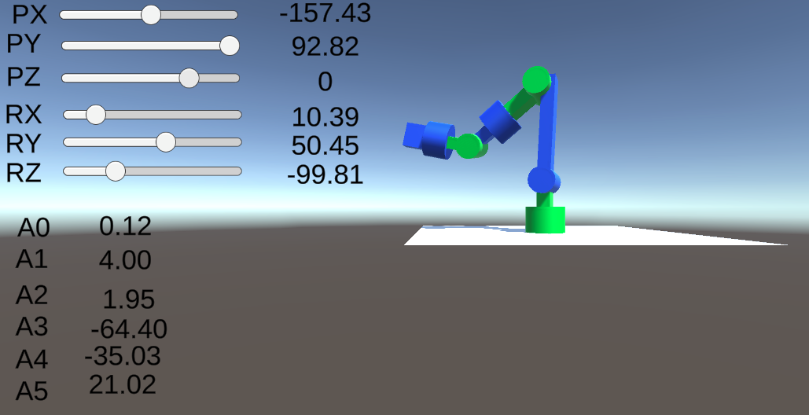

# Robotic arm simulation with Unity

## step1
2DOF forward kinematics

## step2
2DOF forward kinematics (with label)

## step3
2DOF inverse kinematics

## step4
3DOF inverse kinematics

## step5
6DOF inverse kinematics (geomerical method)

## step6
6DOF inverse kinematics (numerical method)

## step7 (WIP)
6DOF inverse kinematics (numerical method)

With angle limit

